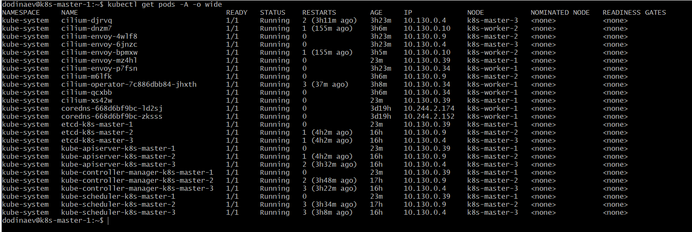
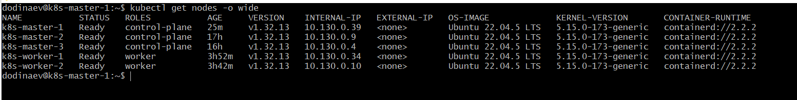
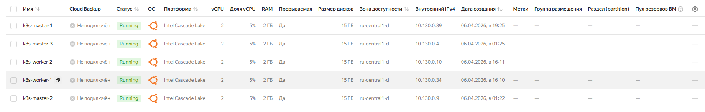
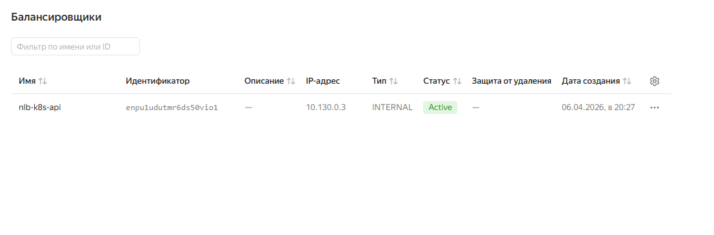

# Домашнее задание к занятию «Установка Kubernetes»

### Цель задания

Установить кластер K8s.

### Чеклист готовности к домашнему заданию

1. Развёрнутые ВМ с ОС Ubuntu 20.04-lts.


### Инструменты и дополнительные материалы, которые пригодятся для выполнения задания

1. [Инструкция по установке kubeadm](https://kubernetes.io/docs/setup/production-environment/tools/kubeadm/create-cluster-kubeadm/).
2. [Документация kubespray](https://kubespray.io/).

-----

### Задание 1. Установить кластер k8s с 1 master node

1. Подготовка работы кластера из 5 нод: 1 мастер и 4 рабочие ноды.
2. В качестве CRI — containerd.
3. Запуск etcd производить на мастере.
4. Способ установки выбрать самостоятельно.

## Дополнительные задания (со звёздочкой)

**Настоятельно рекомендуем выполнять все задания под звёздочкой.** Их выполнение поможет глубже разобраться в материале.   
Задания под звёздочкой необязательные к выполнению и не повлияют на получение зачёта по этому домашнему заданию. 

------
### Задание 2*. Установить HA кластер

1. Установить кластер в режиме HA.
2. Использовать нечётное количество Master-node.
3. Для cluster ip использовать keepalived или другой способ.

### Правила приёма работы

1. Домашняя работа оформляется в своем Git-репозитории в файле README.md. Выполненное домашнее задание пришлите ссылкой на .md-файл в вашем репозитории.
2. Файл README.md должен содержать скриншоты вывода необходимых команд `kubectl get nodes`, а также скриншоты результатов.
3. Репозиторий должен содержать тексты манифестов или ссылки на них в файле README.md.

# Развёртывание High Availability (HA) кластера Kubernetes

В данном документе описан процесс развёртывания production-ready кластера Kubernetes в режиме высокой доступности (HA) с использованием `kubeadm`, облачного Load Balancer и CNI-плагина Cilium с полной заменой `kube-proxy`.

## 1. Архитектура кластера

Было развёрнуто 5 виртуальных машин в облаке Yandex Cloud:


| Роль узла | Hostname |
| :--- | :--- |
| Control Plane (Master) | `k8s-master-1` |
| Control Plane (Master) | `k8s-master-2` |
| Control Plane (Master) | `k8s-master-3` |
| Worker | `k8s-worker-1` |
| Worker | `k8s-worker-2` |

**Сетевые параметры:**
*   **Pod CIDR:** `10.244.0.0/16`
*   **Load Balancer Endpoint:** `{{ LB_IP_ADDRESS }}:6443`
*   **Container Runtime:** containerd v2.2.2
*   **Kubernetes Version:** v1.32.0

## 2. Предварительная настройка узлов

На всех 5 виртуальных машинах были выполнены следующие подготовительные шаги.

### 2.1. Установка containerd

```bash
# Скачивание и установка containerd
wget https://github.com/containerd/containerd/releases/download/v2.2.2/containerd-2.2.2-linux-amd64.tar.gz
tar Cxzvf /usr/local containerd-2.2.2-linux-amd64.tar.gz

# Настройка systemd сервиса
mkdir -p /usr/local/lib/systemd/system/
cd /usr/local/lib/systemd/system/
wget https://raw.githubusercontent.com/containerd/containerd/main/containerd.service
systemctl daemon-reload
systemctl enable --now containerd

# Установка runc
wget https://github.com/opencontainers/runc/releases/download/v1.3.5/runc.amd64
install -m 755 runc.amd64 /usr/local/sbin/runc

# Установка CNI плагинов
wget https://github.com/containernetworking/plugins/releases/download/v1.9.1/cni-plugins-linux-amd64-v1.9.1.tgz
mkdir -p /opt/cni/bin
tar Cxzvf /opt/cni/bin cni-plugins-linux-amd64-v1.9.1.tgz

# Генерация конфигурации containerd
mkdir -p /etc/containerd
containerd config default | sudo tee /etc/containerd/config.toml
```

### 2.2. Установка kubeadm, kubelet, kubectl

```bash
# Установка репозитория Kubernetes
apt-get update
apt-get install -y apt-transport-https ca-certificates curl gpg

curl -fsSL https://pkgs.k8s.io/core:/stable:/v1.32/deb/Release.key | sudo gpg --dearmor -o /etc/apt/keyrings/kubernetes-apt-keyring.gpg
echo 'deb [signed-by=/etc/apt/keyrings/kubernetes-apt-keyring.gpg] https://pkgs.k8s.io/core:/stable:/v1.32/deb/ /' | sudo tee /etc/apt/sources.list.d/kubernetes.list

# Установка компонентов
apt-get update
apt-get install -y kubelet kubeadm kubectl
apt-mark hold kubelet kubeadm kubectl

# Запуск kubelet
systemctl enable --now kubelet

### 2.3. Настройка системных параметров

# Загрузка модулей ядра
cat <<EOF | sudo tee /etc/modules-load.d/k8s.conf
overlay
br_netfilter
EOF

# Настройка sysctl
cat <<EOF | sudo tee /etc/sysctl.conf
net.ipv4.ip_forward=1
net.ipv4.conf.all.forwarding=1
net.ipv6.conf.all.forwarding=1
net.bridge.bridge-nf-call-ip6tables=1
net.bridge.bridge-nf-call-iptables=1
vm.max_map_count=262144
vm.swappiness=0
fs.inotify.max_user_watches=524288
net.ipv6.conf.all.disable_ipv6=1
net.ipv6.conf.default.disable_ipv6=1
fs.inotify.max_user_instances = 2048
EOF

# Применение настроек
sudo sysctl --system
```

### 3. Настройка сети (Load Balancer)

В инфраструктуре Yandex Cloud был создан **Network Load Balancer (NLB)** для обеспечения единой точки входа к control-plane узлам.

| Параметр | Значение |
| :--- | :--- |
| Имя LB | `lb-k8s` |
| Тип | Network Load Balancer |
| Listener (Обработчик) | `k8s-api` |
| Внутренний IP (Endpoint) | `{{ INTERNAL_LB_IP_ADDRESS  }}` |
| Порт LB | `6443` |
| Порт целевой группы | `6443 (порт kube-apiserver)` |
| Протокол | `TCP` |
| Целевые ресурсы | `k8s-master-1, k8s-master-2, k8s-master-3` |

## 4. Инициализация первого Control Plane узла

На узле `k8s-master-1` был создан конфигурационный файл и запущена инициализация кластера.

**Файл конфигурации** (`config.yaml`):

```yaml
# kubeadm-config.yaml
kind: ClusterConfiguration
apiVersion: kubeadm.k8s.io/v1beta4
kubernetesVersion: v1.32.0
controlPlaneEndpoint: "{{ INTERNAL_LB_IP_ADDRESS  }}:6443"   # Адрес Load Balancer
networking:
  podSubnet: "10.244.0.0/16"
---
kind: KubeletConfiguration
apiVersion: kubelet.config.k8s.io/v1beta1
cgroupDriver: systemd
```

**Команда инициализации:**

```bash
sudo kubeadm init --config=config.yaml --upload-certs
```

Флаг ``--upload-certs`` использован для автоматического шифрования и распространения сертификатов между будущими master-узлами.

## 5. Получение данных для присоединения узлов
После успешной инициализации (или позднее, в случае утери данных) были получены следующие параметры для добавления узлов в кластер.

- **На первом мастере** (k8s-master-1):

# Получение токена и CA хэша (команда для worker-узлов)

```bash
kubeadm token create --print-join-command
```

# Генерация сертификатного ключа для добавления новых master-узлов

```bash
kubeadm init phase upload-certs --upload-certs
```
Полученные значения (пример):

| Параметр | Значение |
| :--- | :--- |
| Токен | `{{ CLUSTER_TOKEN }}` |
| CA хэш | ``sha256:{{ CA_CERT_HASH }}`` |
| certificateKey | `{{ CERTIFICATE_KEY }}` |

## 6. Добавление остальных Control Plane узлов
На узлах `k8s-master-2` и `k8s-master-3` был создан конфигурационный файл config.yaml и выполнена команда присоединения.

**Файл конфигурации** (`config.yaml`):

```yaml
apiVersion: kubeadm.k8s.io/v1beta4
kind: JoinConfiguration
discovery:
  bootstrapToken:
    apiServerEndpoint: "{{ INTERNAL_LB_IP_ADDRESS  }}:6443"
    token: "{{ CLUSTER_TOKEN }}"
    caCertHashes:
    - "sha256:{{ CA_CERT_HASH }}"
nodeRegistration:
  name: {{ NODE_NAME }}               # Например: k8s-master-2
  criSocket: unix:///var/run/containerd/containerd.sock
  kubeletExtraArgs:
    - name: cgroup-driver
      value: systemd
controlPlane:
  certificateKey: "{{ CERTIFICATE_KEY }}"
```

**Команда присоединения:**

```bash
sudo kubeadm join --config=config.yaml
```

## 7. Добавление Worker узлов
На узлах `k8s-worker-1` и `k8s-worker-2` был создан конфигурационный файл (отличается отсутствием секции controlPlane и certificateKey).

**Файл конфигурации** (`config.yaml`):

```yaml
apiVersion: kubeadm.k8s.io/v1beta4
kind: JoinConfiguration
discovery:
  bootstrapToken:
    apiServerEndpoint: "{{ INTERNAL_LB_IP_ADDRESS  }}:6443"
    token: "{{ CLUSTER_TOKEN }}"
    caCertHashes:
    - "sha256:{{ CA_CERT_HASH }}"
nodeRegistration:
  name: {{ NODE_NAME }}               # Например: k8s-worker-1
  criSocket: unix:///var/run/containerd/containerd.sock
  kubeletExtraArgs:
    - name: cgroup-driver
      value: systemd
```

**Команда присоединения:**

```bash
sudo kubeadm join --config=config.yaml
```

### 7.1. Назначение ролей Worker (опционально)
Для удобства визуализации, узлам были присвоены метки ролей:

```bash
kubectl label node k8s-worker-1 node-role.kubernetes.io/worker=worker
kubectl label node k8s-worker-2 node-role.kubernetes.io/worker=worker
```

## 8. Настройка kubectl
Для управления кластером с узла `k8s-master-1` (или любого другого) был скопирован конфигурационный файл администратора:

```bash
mkdir -p $HOME/.kube
sudo cp -i /etc/kubernetes/admin.conf $HOME/.kube/config
sudo chown $(id -u):$(id -g) $HOME/.kube/config
```

## 9. Установка CNI плагина (Cilium)
В качестве сетевого решения был выбран Cilium с режимом полной замены стандартного `kube-proxy` на eBPF.

**Установка Cilium CLI:**

```bash
CILIUM_CLI_VERSION=$(curl -s https://raw.githubusercontent.com/cilium/cilium-cli/main/stable.txt)
CLI_ARCH=amd64
if [ "$(uname -m)" = "aarch64" ]; then CLI_ARCH=arm64; fi
curl -L --fail --remote-name-all https://github.com/cilium/cilium-cli/releases/download/${CILIUM_CLI_VERSION}/cilium-linux-${CLI_ARCH}.tar.gz{,.sha256sum}
sha256sum --check cilium-linux-${CLI_ARCH}.tar.gz.sha256sum
sudo tar xzvfC cilium-linux-${CLI_ARCH}.tar.gz /usr/local/bin
rm cilium-linux-${CLI_ARCH}.tar.gz{,.sha256sum}
```

**Установка Cilium в кластер:**

```bash
cilium install \
  --set kubeProxyReplacement=true \
  --set k8sServiceHost={{ INTERNAL_LB_IP_ADDRESS  }} \
  --set k8sServicePort=6443 \
  --set ipam.mode=cluster-pool \
  --set ipam.operator.clusterPoolIPv4PodCIDRList="{10.244.0.0/16}"
```

**Параметры установки:**

- `kubeProxyReplacement=true`: Полная замена kube-proxy на eBPF.

- `k8sServiceHost/Port`: Адрес Load Balancer (т.к. Cilium должен обращаться к API через единую точку входа).

- `clusterPoolIPv4PodCIDRList`: Диапазон IP-адресов для подов (должен совпадать с `podSubnet` из `kubeadm init`).

## 10. Замена kube-proxy

Поскольку Cilium установлен в режиме замены, стандартный `kube-proxy` был удалён вручную:

```bash
kubectl -n kube-system delete ds kube-proxy
kubectl -n kube-system delete cm kube-proxy
```

После удаления компонентов узлы были перезагружены для очистки устаревших правил `iptables`, оставшихся от `kube-proxy`.

## 11. Проверка работоспособности кластера

### 11.1. Статус узлов

```bash
$ kubectl get nodes -o wide
NAME           STATUS   ROLES           AGE     VERSION    INTERNAL-IP   EXTERNAL-IP   OS-IMAGE             KERNEL-VERSION       CONTAINER-RUNTIME
k8s-master-1   Ready    control-plane   6m18s   v1.32.13   10.130.0.39   <none>        Ubuntu 22.04.5 LTS   5.15.0-173-generic   containerd://2.2.2
k8s-master-2   Ready    control-plane   16h     v1.32.13   10.130.0.9    <none>        Ubuntu 22.04.5 LTS   5.15.0-173-generic   containerd://2.2.2
k8s-master-3   Ready    control-plane   16h     v1.32.13   10.130.0.4    <none>        Ubuntu 22.04.5 LTS   5.15.0-173-generic   containerd://2.2.2
k8s-worker-1   Ready    worker          3h33m   v1.32.13   10.130.0.34   <none>        Ubuntu 22.04.5 LTS   5.15.0-173-generic   containerd://2.2.2
k8s-worker-2   Ready    worker          3h23m   v1.32.13   10.130.0.10   <none>        Ubuntu 22.04.5 LTS   5.15.0-173-generic   containerd://2.2.2
```

### 11.2. Статус Cilium

```bash
kubectl -n kube-system exec ds/cilium -- cilium status | grep KubeProxyReplacement
```

**Ожидаемый вывод:**

```bash
KubeProxyReplacement:   True    [{{ NETWORK_INTERFACE }} (Direct Routing)]
```

**Пример:**
```bash
$ kubectl -n kube-system exec ds/cilium -- cilium status | grep KubeProxyReplacement
KubeProxyReplacement:    True   [eth0   10.130.0.4 fe80::d20d:e2ff:fe0e:fd02 (Direct Routing)]
```

### 11.3. Статус подов

```bash
kubectl get pods -n kube-system
```

**Ожидаемый вывод:**
```bash
$ kubectl get pods -n kube-system
NAME                                   READY   STATUS    RESTARTS        AGE
cilium-djrvq                           1/1     Running   2 (3h8m ago)    3h21m
cilium-dnzm7                           1/1     Running   1 (153m ago)    3h4m
cilium-envoy-4wlf8                     1/1     Running   0               3h21m
cilium-envoy-6jnzc                     1/1     Running   0               3h21m
cilium-envoy-bpmxw                     1/1     Running   1 (153m ago)    3h3m
cilium-envoy-mz4hl                     1/1     Running   0               21m
cilium-envoy-p7fsn                     1/1     Running   0               3h21m
cilium-m6lfk                           1/1     Running   0               3h4m
cilium-operator-7c886dbb84-jhxth       1/1     Running   3 (35m ago)     3h6m
cilium-qcxbb                           1/1     Running   0               3h4m
cilium-xs42w                           1/1     Running   0               21m
coredns-668d6bf9bc-ld2sj               1/1     Running   0               3d19h
coredns-668d6bf9bc-zksss               1/1     Running   0               3d19h
etcd-k8s-master-1                      1/1     Running   0               21m
etcd-k8s-master-2                      1/1     Running   1 (4h ago)      16h
etcd-k8s-master-3                      1/1     Running   1 (3h59m ago)   16h
kube-apiserver-k8s-master-1            1/1     Running   0               21m
kube-apiserver-k8s-master-2            1/1     Running   1 (4h ago)      16h
kube-apiserver-k8s-master-3            1/1     Running   2 (3h30m ago)   16h
kube-controller-manager-k8s-master-1   1/1     Running   0               21m
kube-controller-manager-k8s-master-2   1/1     Running   2 (3h46m ago)   17h
kube-controller-manager-k8s-master-3   1/1     Running   3 (3h20m ago)   16h
kube-scheduler-k8s-master-1            1/1     Running   0               21m
kube-scheduler-k8s-master-2            1/1     Running   3 (3h32m ago)   17h
kube-scheduler-k8s-master-3            1/1     Running   3 (3h5m ago)    16h
```

Все поды системы, включая Cilium, CoreDNS и другие, должны находиться в статусе Running.

## 12. Скриншоты

Список подов:

Список нод:

Список VM В консоли YandexCloud:

Балансировщик для взаимодействия с api:


## Заключение

Был успешно развёрнут отказоустойчивый кластер Kubernetes, соответствующий лучшим практикам:

- **Высокая доступность:** Использовано нечётное количество master-узлов (3) для обеспечения кворума etcd.
- **Единая точка входа:** Реализована единая точка входа для API сервера через облачный Network Load Balancer.
- **Сетевое решение:** В качестве CNI используется Cilium с полной заменой kube-proxy для повышения производительности и наблюдаемости сети.
- **Воспроизводимость:** Все конфигурации версионированы и воспроизводимы через декларативные YAML-файлы (kubeadm).